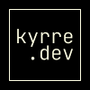

<!-- This template is based on this awesome template:  https://github.com/othneildrew/Best-README-Template -->

<!-- search for the word "replace", and replace all the different instances depending on the project -->

<a name="readme-top"></a>

<br />
<div align="center">
  <a href="https://github.com/kyrregjerstad/portfolio">
    
  </a>

<h3 align="center">Portfolio</h3>

  <p align="center">
  My portfolio page, built with SvelteKit and TypeScript.
    <br />
    <br />
    <a href="https://kyrre.dev">👀 View Deployed Page</a>
  </p>
</div>

<details>
  <summary>📚 Table of Contents</summary>
  <ol>
    <li>
      <a href="#about-the-project">About The Project </a>
      <ul>
        <li><a href="#built-with">Built With</a></li>
      </ul>
    </li>
    <li>
      <a href="#getting-started">Getting Started</a>
      <ul>
        <li><a href="#prerequisites">Prerequisites</a></li>
        <li><a href="#installation">Installation</a></li>
      </ul>
    </li>
    <li><a href="#contact">Contact</a></li>
  </ol>
</details>

## 🎯 About The Project

[![portfolio][product-screenshot]](https://kyrre.dev)

### 🔨 Built With

- [![SvelteKit][svelteKit-badge]][SvelteKit-url]
- [![TypeScript][typescript-badge]][typescript-url]
- [![Iconify][iconify-badge]][iconify-url]
- [![Zod][zod-badge]][zod-url]
- [![Super Forms][super-forms-badge]][super-forms-url]

## 🚀 Getting Started

This is an example of how you may give instructions on setting up your project locally.
To get a local copy up and running follow these simple example steps.

### 📝 Prerequisites

Use the package manager you want, I prefer [pnpm](https://pnpm.io/). If you want to use npm or yarn, just replace `pnpm` with `npm` or `yarn` in the commands below.

Requires `Node.js 16` or later.

### ⚙️ Installation

1. Clone the repo

   ```sh
   git clone https://github.com/kyrregjerstad/portfolio
   ```

2. Navigate to the root folder of the project
   ```sh
   cd portfolio
   ```
3. Install NPM packages

   ```sh
   pnpm i
   ```

4. Start the development server
   ```sh
   pnpm dev
   ```

<p align="right">(<a href="#readme-top">back to top</a>)</p>

## Contact

<ul>
  <li><a href="https://kyrre.dev">🌐 Website</a></li>
  <li><a href="mailto:hi@kyrre.dev">✉️  hi@kyrre.dev</a> </li>
  <li><a href="https://twitter.com/kyrregjerstad">🐦 Twitter</a></li>
  <li><a href="https://www.linkedin.com/in/kyrre-gjerstad/">🔗 LinkedIn</a></li>
</ul>

Project Link: [repo-link]

Live Demo: [deployed-site]

<p align="right">(<a href="#readme-top">back to top</a>)</p>

[SvelteKit-url]: https://kit.svelte.dev/
[svelteKit-badge]: https://img.shields.io/badge/SvelteKit-FF3E00?style=for-the-badge&logo=svelte&logoColor=white
[typescript-badge]: https://img.shields.io/badge/TypeScript-3178C6?style=for-the-badge&logo=typescript&logoColor=white
[typeScript-url]: https://www.typescriptlang.org/
[iconify-url]: https://iconify.design/
[iconify-badge]: https://img.shields.io/badge/Iconify-FFBA08?style=for-the-badge&logo=iconify&logoColor=white
[zod-url]: https://github.com/colinhacks/zod
[zod-badge]: https://img.shields.io/badge/Zod-0A0A0A?style=for-the-badge&logo=zod&logoColor=white
[super-forms-url]: https://superforms.vercel.app/
[super-forms-badge]: https://img.shields.io/badge/Super%20Forms-000000?style=for-the-badge&logo=vercel&logoColor=white
[product-screenshot]: ./static/social/kyrre-social.jpg
[deployed-site]: https://kyrre.dev
[repo-link]: https://github.com/kyrregjerstad/portfolio
